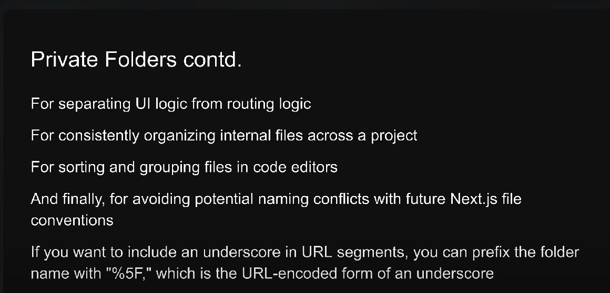

# In NextJs there are Two types of Components

1. Client Side Components
2. Server Side Components

## Server Side Components

1. In Next, all components are Server components by default.
2. They have the ability to read files or fetching data from database.
3. However, they don't have the ability to use hooks or handle user interactions.

## Client Side Components

1. To use Client side component, its necessary to use **'use client'** directive at the top.
2. They can't read files or fetch data from database, but they can use hooks and handle user interactions.

# Page Routing: 

## Private folders: 

In NextJs if you want to create a Private folder, that is not accessible by public URL, prefix the folder name with **'_'** 
